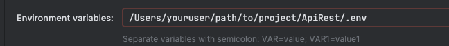

[](https://github.com/miguelpiza93/ApiRest/actions/workflows/pipeline.yml)

# My Store

Esta es una aplicación que brinda las operaciones básicas para el manejo de productos, inventario, ordenes de compra y ventas.

## Requisitos previos

- Docker
- Maven

## Pasos para ejecutar la aplicación usando docker

1. Clona este repositorio en tu máquina local:
2. Compila el proyecto utilizando Maven: `mvn clean package`
3. Construye la imagen de Docker para la aplicación: `docker build -t my-store .`
4. Levanta los contenedores Docker usando Docker Compose: `docker-compose up`
5. Realiza una solicitud GET a http://localhost:8080/api/v1/units
   - Deberías recibir una respuesta con la siguiente estructura:
     ```javascript
     [
      {
        "id": 1,
        "name": "Carton",
        "symbol": "CRT",
        "fractional": false,
        "baseUnit": false
      }
     ]
      ```
6. Para Destruir los contenedores puedes ejecutar: `docker-compose down -v`

## Errores frecuentes
- Error: Database is uninitialized and superuser password is not specified.
  - Asegúrate de que el archivo .env esté presente: 
    - Crea un archivo .env en el mismo directorio que tu docker-compose.yml
    - Define las variables POSTGRES_USER y POSTGRES_PASSWORD. 
  - Ejemplo de un archivo .env:
      ```javascript
        SPRING_DATASOURCE_URL=jdbc:postgresql://localhost:5432/my_store
        POSTGRES_USER=my_awesome_user
        POSTGRES_PASSWORD=my_awesome_pass
        ALLOWED_ORIGIN=http://localhost:3000
      ```

## Pasos para ejecutar la aplicación en local

### Requisitos previos
- Maven
- Postgresql (crea una bd con nombre my_store)
- Intellij IDEA

1. Crea el archivo .env usando el ejemplo proporcionado en .env.example
2. Configura IntelliJ para que cargue el archivo .env

3. Puedes proceder a ejecutar el proyecto.

## Pasos para develop

1. Ve al folder principal del proyecto
2. Genera un ambiente virtual para instalar pre commit `virtualenv -p python3 env`
3. Activa el ambiente `source .venv/bin/activate`
4. Instala pre commit `pip3 install pre-commit`